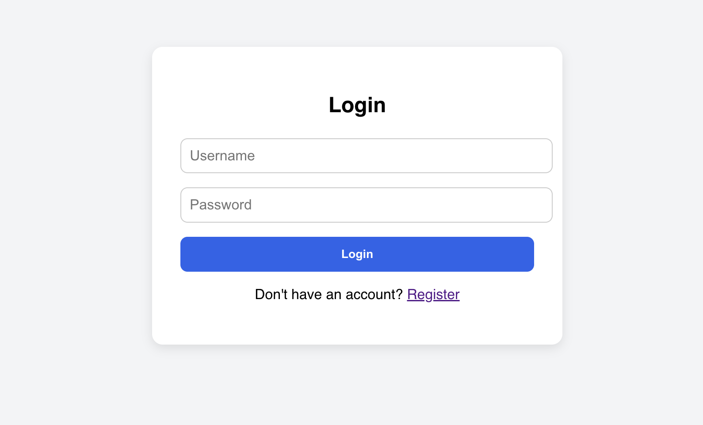
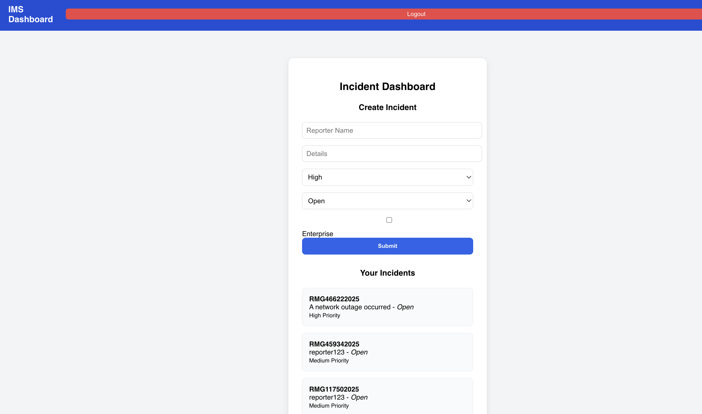

# Incident Management System

This is a full-stack application to report and manage incidents.

## 🔧 Tech Stack
- **Frontend:** React.js + Axios + React Router
- **Backend:** Django + Django REST Framework + MySQL + JWT
- **Auth:** JWT Authentication using `djangorestframework-simplejwt`

## ✨ Features
- User Registration with Profile
- JWT-based Login
- Create, View, Update Incidents (CRUD)
- Incidents have ID, Status, Priority
- Role-based Access (Only reporter can view/edit their incidents)
- Responsive UI with basic styling
- Logout + Protected Dashboard

## 🚀 How to Run

### Backend
```bash
cd ims
python manage.py migrate
python manage.py runserver


Frontend
cd ims-frontend
npm install
npm start
📦 Folder Structure

incident-management-system/
├── ims/              # Django backend
├── ims-frontend/     # React frontend
├── env/              # Virtual environment (ignored)
└── README.md

---


## 🔍 Screenshots

### 🟦 Login Page



### 🟩 Register Page


### 🟨 Dashboard

